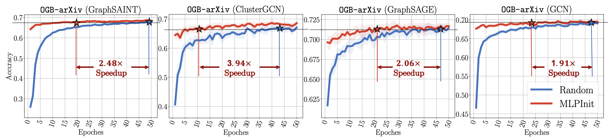
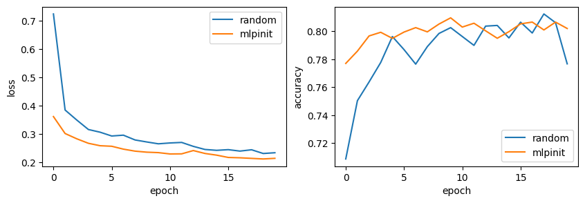
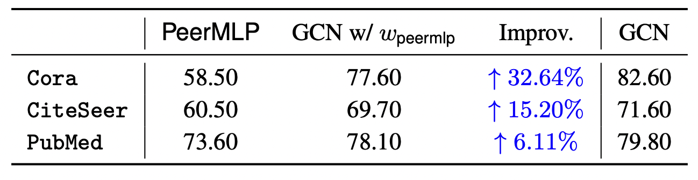

# MLPInit: Embarrassingly Simple GNN Training Acceleration with MLP Initialization

Implementation for the ICLR2023 paper, _MLPInit: Embarrassingly Simple GNN Training Acceleration with MLP Initialization_,  [[openreview]](https://openreview.net/forum?id=P8YIphWNEGO) [[arxiv]](https://arxiv.org/abs/2210.00102) [[slides]](https://ahxt.github.io/files/mlpinit_slides.pdf), by [Xiaotian Han](https://ahxt.github.io/), [Tong Zhao](https://tzhao.io/), [Yozen Liu](https://scholar.google.com/citations?user=i3U2JjEAAAAJ&hl), [Xia Hu](https://cs.rice.edu/~xh37/index.html), and [Neil Shah](http://nshah.net/).

## 1. Introduction

Training graph neural networks (GNNs) on large graphs is complex and extremely time consuming. This is attributed to overheads caused by sparse matrix multiplication, which are sidestepped when training multi-layer perceptrons (MLPs) with only node features. MLPs, by ignoring graph context, are simple and faster for graph data, however they usually sacrifice prediction accuracy, limiting their applications for graph data. We observe that for most message passing-based GNNs, we can trivially derive an analog MLP (we call this a PeerMLP) with an equivalent weight space, by setting the trainable parameters with the same shapes, making us curious about how do GNNs using weights from a fully trained PeerMLP perform? Surprisingly, we find that GNNs initialized with such weights significantly outperform their PeerMLPs, motivating us to use PeerMLP training as a precursor, initialization step to GNN training. To this end, we propose an embarrassingly simple, yet hugely effective initialization method for GNN training acceleration, called MLPInit. Our extensive experiments on multiple large-scale graph datasets with diverse GNN architectures validate that MLPInit can accelerate the training of GNNs (up to 33× speedup on OGBN-Products) and often improve prediction performance (e.g., up to 7.97% improvement for GraphSAGE across 7 datasets for node classification, and up to 17.81% improvement across 4 datasets for link prediction on Hits@10).
### The training speed comparison of the GNNs with Random initialization and MLPInit.



## 2. Minimal Example

### 2.1 We provide a self-contained [Jupyter Notebook](minimal_example_of_mlpinit.ipynb) to show the results on ogb-products dataset.



### 2.2 We provide the demo for MLPInit.

```bash
## cmd for ogbn-products dataset
python demo/ogbn_sage.py --init_method random --dataset ogbn-products
python demo/ogbn_sage.py --init_method mlp    --dataset ogbn-products
```

### 2.3 We also provide the [Jupyter Notebook](gcn_peermlp_comparison.ipynb) to examine the performance of GCN with the weight of PeerMLP (Table 7).




## 3. Running Environments

### 3.1 Main python packages and their version
```
torch                   1.9.0
torch-geometric         2.0.4
ogb                     1.3.3
```

### 3.2 Environment Setup
We use conda to setup the runing environment. GPU installation is required to meet our requirements.

```bash
conda create --name mlpinit  python=3.7
conda activate mlpinit
pip install torch==1.9.0+cu111 -f https://download.pytorch.org/whl/torch_stable.html
pip install -r requirements.txt
```

### 3.3 Datasets
All the datasets will be automatically download by torch-geometric packages.


## 4. MLPInit

You can use the following command to reproduce the results of ogbn-arxiv on GraphSAGE in Table 4. We also provide a shell script [run.sh](run.sh) for other datasets.
```bash
## cmd for PeerMLP training
python -u src/main.py --batch_size 1000 --dataset ogbn-arxiv --dim_hidden 512 --dropout 0.5 --epochs 50 --eval_steps 1 --lr 0.001 --num_layers 4 --random_seed 31415 --save_dir . --train_model_type mlp --gnn_model GraphSAGE --weight_decay 0
## cmd for GraphSAGE training with MLPInit
python -u src/main.py --batch_size 1000 --dataset ogbn-arxiv --dim_hidden 512 --dropout 0.5 --epochs 50 --eval_steps 1 --lr 0.001 --num_layers 4 --random_seed 31415 --save_dir . --train_model_type gnn --gnn_model GraphSAGE --weight_decay 0 --pretrained_checkpoint ./ogbn-arxiv_GraphSAGE_mlp_512_4_31415.pt 
```


## 5. Cite Our Paper

If you find our paper or code is useful for you research, please cite our paper.

```BiBTeX
@inproceedings{han2023mlpinit,
        title={{MLPI}nit: Embarrassingly Simple {GNN} Training Acceleration with {MLP} Initialization},
        author={Xiaotian Han and Tong Zhao and Yozen Liu and Xia Hu and Neil Shah},
        booktitle={International Conference on Learning Representations},
        year={2023},
        url={https://openreview.net/forum?id=P8YIphWNEGO}
}
```

## 6. Credits
The GNN architectures and training code are based on https://github.com/VITA-Group/Large_Scale_GCN_Benchmarking

## 7. Contact
Please contact [Xiaotian Han](https://ahxt.github.io/) if you have any question about this code.


